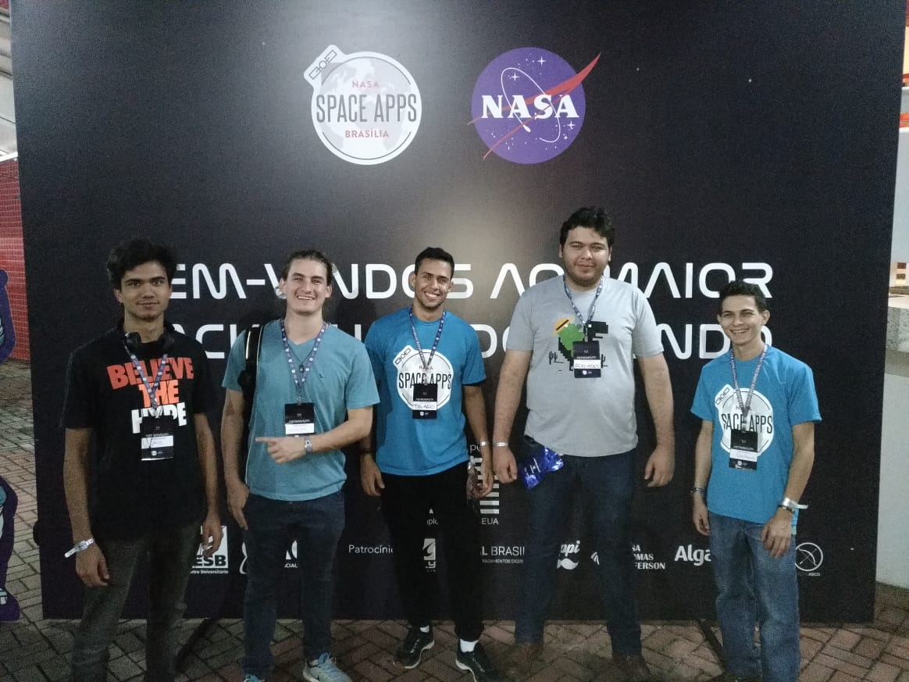
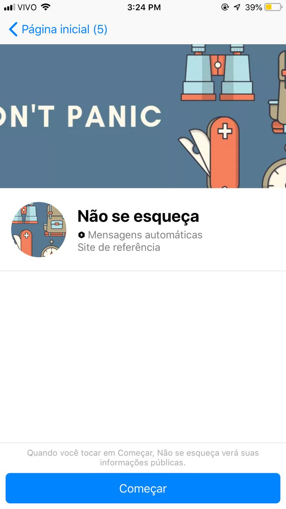
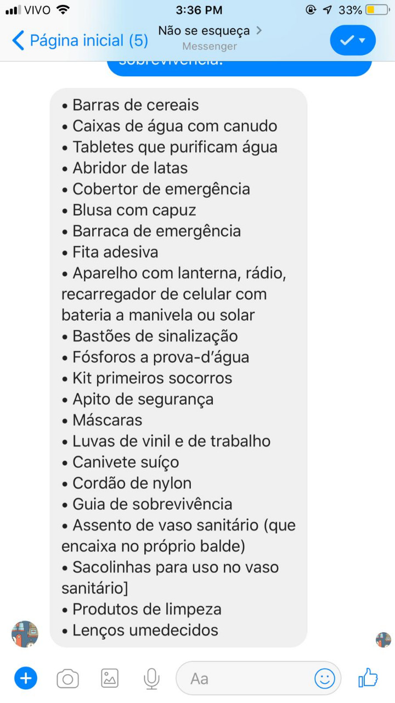
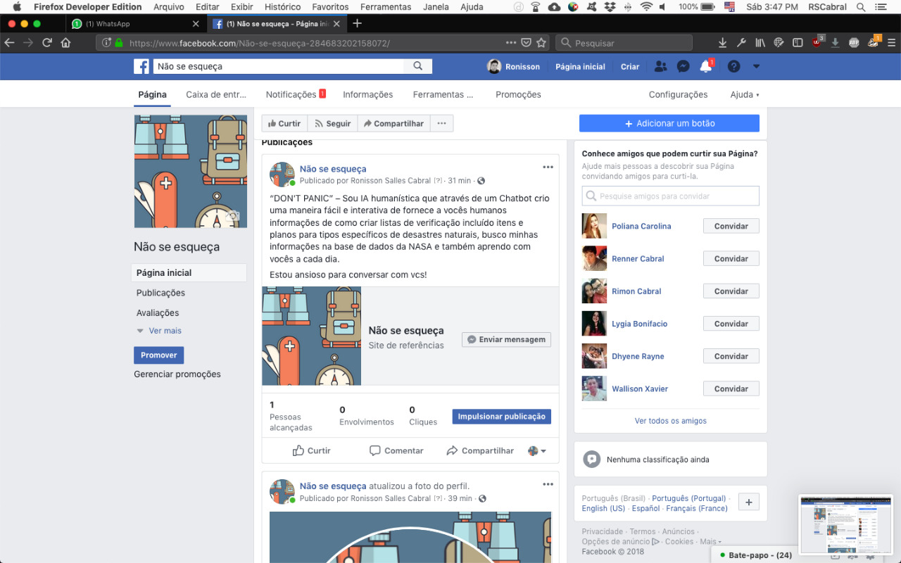

# NASA SPACE APPS - DON'T PANIC

### DESAFIO: Não se esqueça do abridor de latas

---

### DESCRIÇÃO: 

Catástrofes naturais geram bilhões de dólares em prejuízos, levam 24 milhões de pessoas à miséria e causam milhares de mortes todos os anos.  
Um outro ponto a ser considerado, é o aumento da ocorrência das catástrofes. Segundo estudos, devido ao aquecimento global, a cada ano é registrado um número maior de catástrofes naturais extremas principalmente relacionadas a tempestades, gerando tufões, enchentes, deslizamentos de terra, e furacões.  
Mesmo dispondo de extensos registros de observações feitos por equipamentos tecnológicos, como as sondas de monitoramento da NASA, as organizações internacionais não garantem acessibilidade de informações úteis à prevenção e mitigação dos desastres ao público.  
Apesar de não ser possível prever o momento exato de certos eventos, já existem fontes com dados suficientes para ajudar e preparar as pessoas mais vulneráveis.  
Criar uma ferramenta prática e acessível seria uma solução viável e eficiente, e permitiria a conscientização e correta instrução quanto a procedimentos preventivos para situações de desastre natural iminente. 

---

### SOLUÇÃO:

* **Proposta**: orientar a tomada de medidas de prevenção e mitigação para situações emergenciais em casos de desastres naturais iminentes.  
* **Ferramenta**: composta por tutoriais, posts de conteúdo informativo, dados, sistema de alertas (informes e avisos) e orientações (itens a se adquirir, lugares onde ir e medidas a se tomar).  
* **Público Alvo**: pessoas que morem, que estejam ou que vão viajar para áreas consideradas de risco (regiões afetadas por intempéries e/ou consequências de atividades sísmicas).  
* **Veículo**: página no Facebook (posts frequentes sobre fenômenos naturais desastrosos e suas localidades, bem como um chatbot com função de responder a questionamentos específicos dos usuários ou mesmo orientá-los quanto a procedimentos como preparação de kits de emergência, evacuação, etc.). 

---

### PRODUTO:

#### [Don't Panic Facebook](https://www.facebook.com/N%C3%A3o-se-esque%C3%A7a-284683202158072/)

* **Página no Facebook**: posts de conteúdo informativo e técnico.
* **Chatbot** com integração na página do Facebook: orienta o usuário quanto ao planejamento e preparação para desastres iminentes. Propõe checklists para montagem de kits de emergência. Desde a primeira interação, o usuário passa a receber, por chat, alertas a respeito de fenômenos naturais locais que possam lhe trazer riscos. 

**Importante**: a ferramenta “Don’t panic!” se restringe ao momento prévio ao acontecimento desastroso, visto que seu objetivo é orientar sobre ações de prevenção e mitigação.

---

### FUTURO:

Para próximas etapas seria importante fazer a integração com mais APIs e ter um centralizador de informações para conseguir fazer integrações com diversos canais de comunicação.  
Uma opção relevante seria fazer uma parceria com a Defesa Civil, aqui no Brasil, para dar mais suporte aos alertas recebidos via SMS que a Defesa Civil envia.

---

### DESENVOLVIMENTO

* Foi usada a ferramenta [ChatFuel](https://chatfuel.com/) para desenvolver o ChatBot. Ela é uma ferramenta coloborativa de Criação de Chatbots freemium integrada ao Messenger do Facebook.

* APIs utilizadas:
  - API Facebook de Marketing;
  - API DA NASA: https://disasters.nasa.gov/news/nasa-disasters-mapping-portal-launches

**Importante** : Para a criação dos posts foi utilizado dados videos e imagens obtidos no site da [NASA](https://www.nasa.gov/)

---

### GRUPO

Grupo do Hackathon composto por:  
* Caio Andrade Oliveira
* Guilherme Baldissera
* Ronisson Salles Cabral
* Thiago Santos de Lima
* Vitor Hugo Rodrigues Miranda  

---

### REFERÊNCIAS

* https://www.bbc.com/portuguese/brasil-41333057
* https://nacoesunidas.org/desastres-naturais-levam-24-milhoes-de-pessoas-por-ano-a-situacoes-de-pobreza/
* https://www.cptec.inpe.br/
* https://www.giss.nasa.gov/

---

### IMAGENS 

